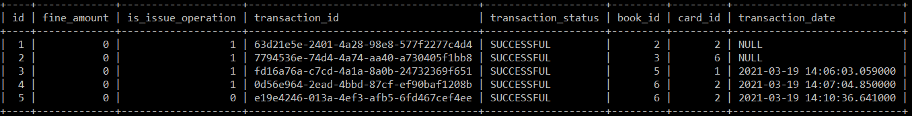

## Backend Design 
### Entities 
Actors/Entities are inspired by the real world entities that can use the applications  
1. **Student** having attributes:
* unique primary key student_id, country, emailId, name, age, card_id(foreign key) 
2. **Card** having attributes:
* unique primary key card_id, createdOn, updatedOn, status(ACTVATED/DEACTIVATED)
3. **Book** having attributes:
* Unique primary key book_id, isAvailable(True/False), genre, author_id(foreign key) 
4. **Author** having attributes:
* unique primary key author_id, country, name, emailId
5. **User** used mainly for authentication and authorization has attributes:
* unique primary key user_id, Authorization--> (STUDENT/ADMIN or BOTH), Username(emailId for student), Password. 

### Relationships Between Entities and ER diagram
An additional SQL table created to map the N:M mapping between the **Card** and the **Book** called **Transaction table**. The Transaction table has the following entities:
* unique primary key transaction_id which is not given back to the client
* Randomly Generated UUID given back to the calling client after the request is processed for future queries regarding the transactions
* Card_id Foreign  key
* Book_id Foreign key 
* isIssue Operations (true for issue operations and false for return operation)
* Transaction status (SUCCESSFUL/PENDING/FAILED)
* date
* fine amount (Applicable only while return operations and fine calculated based on a pre-defined Business logic written clearly in the Transaction Service class)

##### Return Book
**https://localhost:8080/returnBook?bookId=_&cardId=_** goes through the following operations before returning a book into the library.
Constraints: -->
1. Check if the book_id and card_id given is valid?
2. Check if card_id is Activated(As when the student account is deleted by the student the card remains there in a Deactivated state for further accountability).
Operations :-->
1. Make book available.
2. Make the card_id linked with the book null.
3. From the transaction Repository find the latest transaction entry in the table with the same card_id and book_id and is an issue opearation. Find the date from that and calculate the fine.
4. Make a new entry into the transaction table as an return operation and return the fine and unique UUID of the transaction entry to the calling client as a Response Entity.

Various transaction entries in the table:

 
### Security (Checkout Branch Security)
Spring Security is used for Authentication and Authorization. For every API call it is checked whether the calling entity has cookies that make it a valid entity in the system and the Username(emailId in the student table) is the same as the details of whichever entity is changed by hitting a CRUD API regarding that table.
* Few Examples:
Each example API preceeded by "http://localhost:8080"

* /student/all--> gives a list of all students in the system (ADMIN)
* /student/findById --> gives a student with particular id (ADMIN)
* /student/updateStudent--> update student details (STUDENT)[ADMIN should not be allowed to change the student details]
* /student/changePassword--> Strictly STUDENT access
* /transaction/all--> gives a list of all transactions in the system (ADMIN) 
* /transaction/issueBook--> issues a book(STUDENT)  
.....
## Author and Developed by
muse Teshale

